# SKN06-2nd-5Team
## 2차 프로젝트 - Telco Customer Churn / 통신사 고객 이탈 예측

 - 기간 2024.11.13 ~ 2024.11.16
   
[프로젝트 개요](#프로젝트-개요) | [프로젝트 과정](#프로젝트-과정) | [데어터전처리](#데이터-전처리) | [모델](#모델) | [ML](#ml) | [DL](#dl)

## 팀 소개
  ### 팀명 : Churn Busters

  ### 팀원 👥  

|  |  |  |   |
|:----------:|:----------:|:----------:|:----------:|
| 강채연 | 유경상 | 박미현 | 홍 준 |
|[@codus090880](https://github.com/codus090880)|[@kyungsangYu](https://github.com/kyuyounglee)|[@ppim321](https://github.com/ppim321)|[@zl-zone](https://github.com/silenc3502)|
| DL | DL | ML | ML |  

## 프로젝트 개요

### 소개
- 통신사 고객 데이터를 활용하여 고객의 이탈(Churn)예측과 고객의 특성 요소들을 시각화
- 고객의 다양한 서비스 이용 패턴을 분석하고 고객의 이탈 예측을 위한 분류예측모델을 구축

### 필요성
- 고객 유지율 향상 : 이탈 위험이 높은 고객을 사전에 파악하여 적절한 대응 전략 수립
- 수익성 개선 : 고객 이탈로 인한 매출 손실 최소화
- 맞춤형 서비스 제공 : 고객 특성에 따른 개인화된 서비스 및 프로모션 설계
- 경영 의사결정 지원 : 데이터 기반의 객관적인 고객 관리 전략 수립

### 목표
- 고객 이탈을 정확히 예측할 수 있는 머신러닝 딥러닝 모델 개발 (목표 정확도: 80% 이상)
- 이탈에 영향을 미치는 주요 요인 파악 및 인사이트 도출
- 고객 세그먼트별 이탈 위험도 분석 및 시각화
- 고객 유지를 위한 실행 가능한 전략 제안
  
  이 프로젝트를 통해 팀원들은 실제 비즈니스에서 직면할 수 있는 데이터 분석을 통해
  간접적으로 실무 경험을 쌓고, 고객 행동 예측 모델 개발 역량을 키울 수 있을 것으로 기대합니다.
  또한, 통신 산업의 고객 관리 전략에 대한 이해를 높이고 실무적인 문제 해결 능력을 향상시킬 수 있을 것입니다.

[프로젝트 개요](#프로젝트-개요) | [프로젝트 과정](#프로젝트-과정) | [데어터전처리](#데이터-전처리) | [모델](#모델) | [ML](#ml) | [DL](#dl)  

## 프로젝트 과정  

### 활용 데이터
- 프로젝트에 사용할 데이터는 통신사의 고객 정보와 이용중인 서비스 형태를 포함.

 출처 : Kaggle
 dtypes: float64(1), int64(2), object(18)
 RangeIndex: 7043 entries, 0 to 7042
 Data columns : total 21 columns  
Target : Yes(1) : No(0) = 27 : 73

| # | Column | Non-Null | Count | Dtype |
|:---:|:---:|:---:|:---:|:---:|
| 0 | customerID    | 7043 |non-null  |   object |
| 1  | gender       | 7043 |non-null  |   object |
| 2  | SeniorCitizen| 7043 |non-null  |   int64 | 
| 3  | Partner      | 7043 |non-null  |   object |
| 4  | Dependents   | 7043 |non-null  |  object |
| 5  | tenure          |7043 |non-null  |  int64  |
| 6  | PhoneService    | 7043 |non-null  |   object |
| 7  | MultipleLines    | 7043 |non-null |  object |
| 8  | InternetService   | 7043 |non-null  |   object |
| 9  | OnlineSecurity      | 7043 |non-null  |   object |
| 10  | OnlineBackup        | 7043 |non-null  |   object |
| 11  | DeviceProtection    | 7043 |non-null  |   object | 
| 12  | TechSupport         | 7043 |non-null  |   object |
| 13  | StreamingTV         | 7043 |non-null  |   object |
| 14  | StreamingMovies     | 7043 |non-null  |   object |
| 15  | Contract            | 7043 |non-null  |   object |
| 16  | PaperlessBilling    | 7043 |non-null  |   object |
| 17  | PaymentMethod       | 7043 |non-null  |   object |
| 18  | MonthlyCharges      | 7043 | non-null  |   float64 |
| 19  | TotalCharges        | 7043 | 11        |   object |
| 20  | Churn               | 7043 | non-null  |   object |

### 데이터 컬럼 정보 확인  
- 데이터 분석을 위해 컬럼의 정보 확인
- 학습에 참여할 변수나 수치형 데이터 확인

### 변수 간의 관계를 시각화  
( positive : 빨간색, negative : 파란색, 색이 짙을수록 상관관계의 절대값이 큼)

- SeniorCitizen와 Churn: 약한 양의 상관관계(0.15), SeniorCitizen(고령자)일수록 Churn(이탈) 가능성이 약간 증가하는 경향
- tenure와 Churn: 약한 음의 상관관계(-0.35), 고객의 가입 기간(tenure)이 길수록 이탈 가능성이 낮아지는 경향(비교적 의미 있는 수준)
- MonthlyCharges와 Churn: 약한 양의 상관관계(0.19), 월 요금(MonthlyCharges)이 높을수록 이탈 가능성이 약간 증가하는 경향
- tenure와 MonthlyCharges: 약한 양의 상관관계(0.25). 가입 기간이 길어질수록 월 요금이 약간 증가하는 경향

전체적으로 상관관계가 강하지 않음을 보여주며, 고객 이탈에 영향을 미칠 수 있는 주요 변수로는
 가입 기간(tenure)이 가장 두드러집니다.  

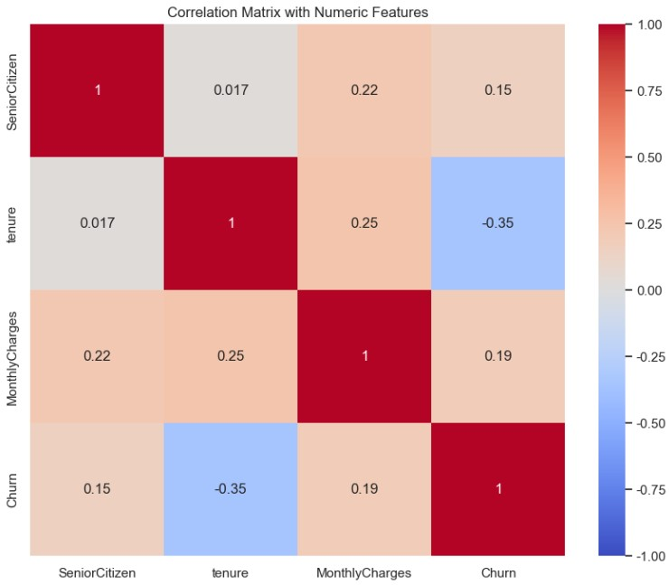 

### 데이터 전처리
#### 1. 결측치 처리
for 구문을 통해 TotalCharges 컬럼에서 11개의 공백 또는 NaN 값이 있는 것을 확인.   
TotalCharges 컬럼의 데이터 분포를 확인 후 결측치를 중앙값으로 대체.

#### 2. 인코딩  
 범주형, 수치형 변수를 Label Encoding과 One-Hot Encoding 하여 전처리를 진행
- 범주형 데이터를 숫자로 변환.
- 다중 범주 변수(두 개 이상의 값을 가지는 변수)에 대해 One-Hot Encoding을 적용

[프로젝트 개요](#프로젝트-개요) | [프로젝트 과정](#프로젝트-과정) | [데이이터전처리](#데이터-전처리) | [모델](#모델) | [ML](#ml) | [DL](#dl)  

##  모델

## ML
**개요**: 이진 분류(0: 이탈하지 않은 고객, 1: 이탈한 고객) 문제이므로, 사용할 모델을 다음과 같이 구상하였다.

   1. **로지스틱 회귀(Logistic Regression)**
  - 장점: 간단하고 해석이 쉬운 모델로, 결과에 대한 해석이 쉽고, 빠르게 학습 및 평가할 수 있다.
  - 적합한 경우: 데이터가 비교적 선형적으로 구분 가능할 때 좋은 성능을 보인다.   
   2. **랜덤 포레스트 (Random Forest)**   
  - 장점: 여러 개의 결정 트리를 이용한 앙상블 학습으로, 변수의 상호작용을 잘 파악하고, 높은 예측 성능을 보이며, 이상치와 결측치에 어느 정도 견고하다.   
  - 적합한 경우: 비선형적인 관계를 포함한 복잡한 데이터에서 강력한 성능을 발휘한다.
   3. **Gradient Boosting Machines (GBM), XGBoost**
  - 장점: 강력한 앙상블 학습 모델로, 데이터가 복잡한 경우에도 좋은 성능을 보인다.

### 1. 교차 검증 및 모델 학습 수행

   - StratifiedKFold
   - Cross-Validation
   - pipeline  

#### 요약: 교차 검증

데이터 불균형 발견: 0과 1의 전체적인 정확도 재현율 수치가 많이 다름. 
→ 모델을 비교하기 전에 오버샘플링 기법인 SMOTE 사용 시도.  

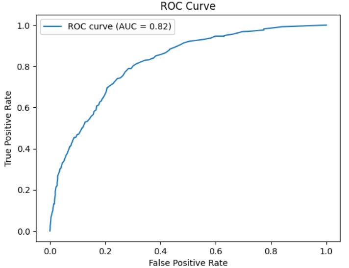    

### SMOTE  성능 확인
클래스 1(이탈 고객)에 대한 recall 값이 약간 개선되것을 확인: SMOTE의 사용이 유의미해 보인다고 판단하였다.

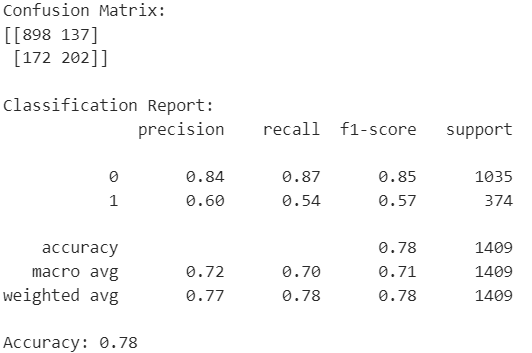 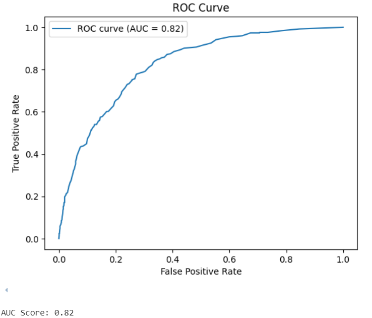  

### 2. 모델 비교  

### RF 랜덤포레스트, XGB                               
                                

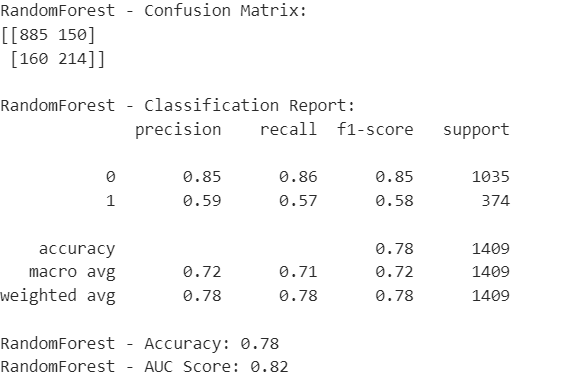        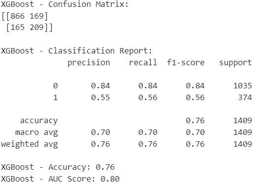  
  
### 앙상블 기법 시도  
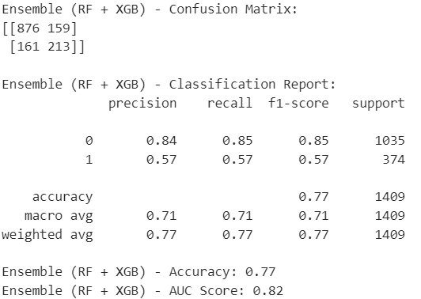    

#### 요약
전반적인 성능이 Random Forest와 XGBoost가 비슷함. 앙상블 기법을 시도해 보았지만, 딱히 개선이 없음.
그나마 Random Forest가 성능이 XGBoost보다 나은 것이 확인되어 Random Forest 모델로 성능 개선을 시도해 보기로 함.

### 하이퍼파라미터 최적화된 RandomForest  

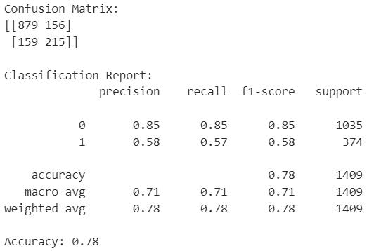 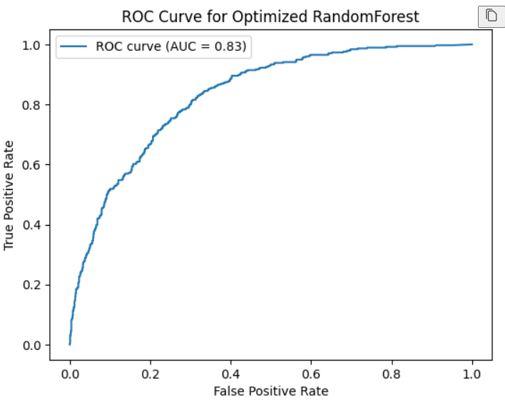  

### 중요도 낮은 특성 제거 파생 변수 생성 RandomForest 

  

#### 요약
Random Forest 모델을 데이터에 맞추어서 최적화 작업을 진행하였는데도 불구하고 전혀 개선된 모습을 볼 수가 없었다. 과적합 문제가 발생한 것인지 확인하기 위해 XGBoost도 하이퍼파라미터 최적화 작업을 수행 후에 앙상블 기법을 사용하였다.

     
### 앙상블 기법 (RF + XGB)
     
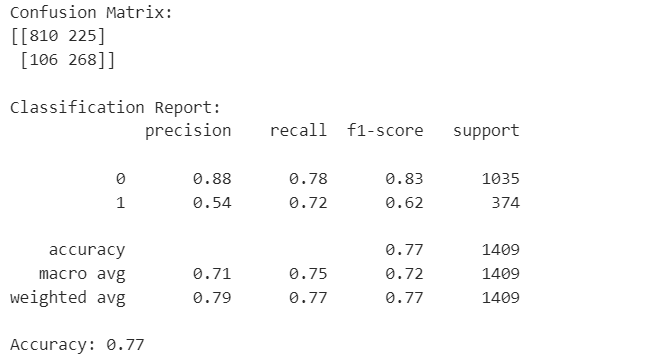  

#### 요약
클래스 1의 정밀도는 제일 낮게 나왔지만, 재현율은 제일 잘 나온 것을 확인을 할 수 있었다. 
클래스 1에 대해 패턴을 학습하려는 경향을 크게 가지면서 과적합이 발생한다고 판단하여 로지스틱 회귀 모델을 시도하였다. 

### Logistic Regression(로지스틱희귀)
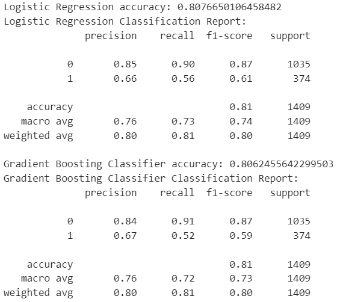  

#### 요약
클래스 1의 정밀도에 대해 성능이 제일 우수한 것을 확인할 수 있었다. 따라서 랜덤 포레스트와 XGBoost는 소수 클래스 1에 대해 과적합이 발생하여 정밀도가 낮게 나왔다는 것을 증빙해 주었다.

XGBoost는 클래스 1에 있어서 가장 높은 재현율을 보여주었으므로 로지스틱 회귀와 XGBoost를 앙상블 기법으로 클래스 1의 정밀도와 재현율을 높일 수 있을지 확인 해보았다.

### 3. 모델 재선택 및 결정: Ensemble(Logistic + Gradient + XGB)
    
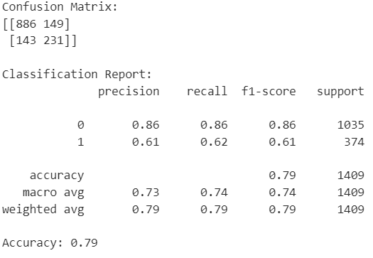  

#### 요약
결국 로지스틱 회귀와 XGB(XGBoost)를 앙상블 기법으로 결합함으로써 클래스 1의 정밀도와 재현율을 둘 다 높일 수 있었다.

Logistic Regression은 모델의 단순성 덕분에 일반화 성능이 좋아서 높은 정확성를 유지한 것으로 보임.

XGBoost 모델의 자체 기능 부스팅은 약한 학습기(weak learner)들을 연속적으로 개선해나가는 과정에서 오차에 더 많은 가중치를 부여하여 학습을 진행하기 때문에 과적합이 발생하여 클래스 1(이탈 고객)에 대한 정확도는 낮았지만, 높은 재현율을 보여 준 것 같다.

이런 두 모델의 뚜렷한 차이는 단독 모델로 데이터를 학습하였을 때 RandomForest에 비해 약간 낮은 성능을 보였지만, 앙상블을 이용하여 활용하였을 때 두 모델의 장점이 적절히 합쳐지며 좋은 성능을 보였다.

예상대로 가중치를 XGB에 둘수록 클래스 1의 재현율은 올라가지만, 정밀도는 감소하고
로지스틱 회귀에 가중치를 두면 클래스 1의 정밀도는 올라가지만, 재현율은 떨어지는 모습을 보였다.
하지만 가중치를 특정 모델에 치우치게 설정하면 오히려 성능이 저하되는 모습을 보였으며 가장 적절한 설정은 [2,1,2] 혹은 [3,2,3] 조합이 제일 좋았으며 순서대로 로지스틱 회귀, gradient, XGB를 의미한다.

여기서 재현율을 더 올리기 위해서는 가중치 보다는 threshold를 4 혹은 4.5로 조절하는게 좋아보인다.

더 나은 성능을 위해서는 하이퍼파라미터 조합을 찾는 것을 추천하며 주요 특성이 아닌 컬럼을 제거하는 경우는 데이터 불균형을 야기하여 성능저하나 클래스 1의 정밀도를 오히려 낮추는 결과를 초래하였다.

오버샘플링 기법의 경우는 단독 모델에서는 성능을 보였으나, 앙상블 기법에서는 오히려 성능을 저하 시켰다.

  
### ML - 최종 모델 Ensemble(Logistic + Gradient + XGB)

#### 모델1: 클래스 1(이탈 고객)의 정확도를 우선시 하는 경우
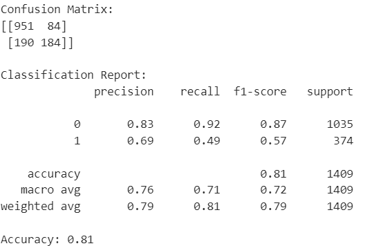  

#### 모델 2: 클래스 1의 정확도와 재현율을 모두 고려한 경우
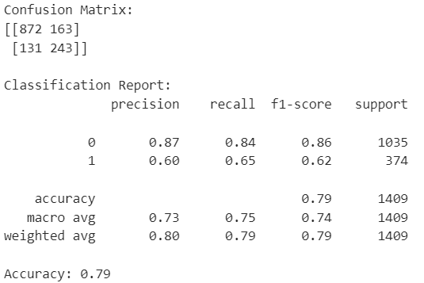    

[프로젝트 개요](#프로젝트-개요) | [프로젝트 과정](#프로젝트-과정) | [데어터전처리](#데이터-전처리) | [모델](#모델) | [ML](#ml) | [DL](#dl)  

    
## DL
1. Target이 (0,1)인 데이터로 이진분류를 사용하였고 따라서 손실함수로는 BCEloss를 optimizer로는 Adam을 사용하였다.
train/test의 batchsize=128, epochs=1000, lr=0.01, 중간 Layer로는 3개의 Liinear를 사용할떄가 가장 성능이 좋았다.

2. BatchNormalize나 Dropout을 시도해봤지만 Layer가 적어서 오히려 성능이 떨어졌다.

3. learning rate scheduler = CosineAnnealingWarmRestarts

train loss와 test loss의 차이가 크다.
이것은 Overfitting이 된것임을 알 수 있고 이를 해소하기위해 L2 정규화를 시도하였다.

4. learning rate scheduler = CosineAnnealingWarmRestarts + L2정규화

CosineAneelingWarmRestarts를 통해 학습률을 변화시키고 L2정규화를통해 가중치의 크기를 억제시켜 Overfitting을 줄일 수 있다.
하지만 여전히 train loss와 test loss의 차이가 크다.

6. learning rate scheduler = stepLR

또다른 학습률 스케줄려인 stepLR을 적용해보았더니 비교적 Overfitting 문제가 해소된 것으로 보인다.

7. learning rate scheduler = stepLR + SMOTE

데이터 특성상 class1에 대한 recall값을 중요한 성능 지표로삼았다.
recall값을 향상시키기 위해 Oversampling을 하기위해  SMOTE를 적용해보았다.
recall값이 0.48에서 0.62정도로 향상되었고 recall값이 향상되면 precision이 낮아진다는 점을 고려하더라도
f1 score가 소폭 향상되어 의미있는 결과를 얻었다.

### 결과 요약:

### 결론:
  

### 📚 Stacks  

#### Environment

#### Development

#### Communication
  

  
  
## 한 줄 회고
채연 - 쉽지 않다 .......
 경상 -
 미현 - 정량 분석 정성 분석.. 데이터 또한 어렵
 준 -
